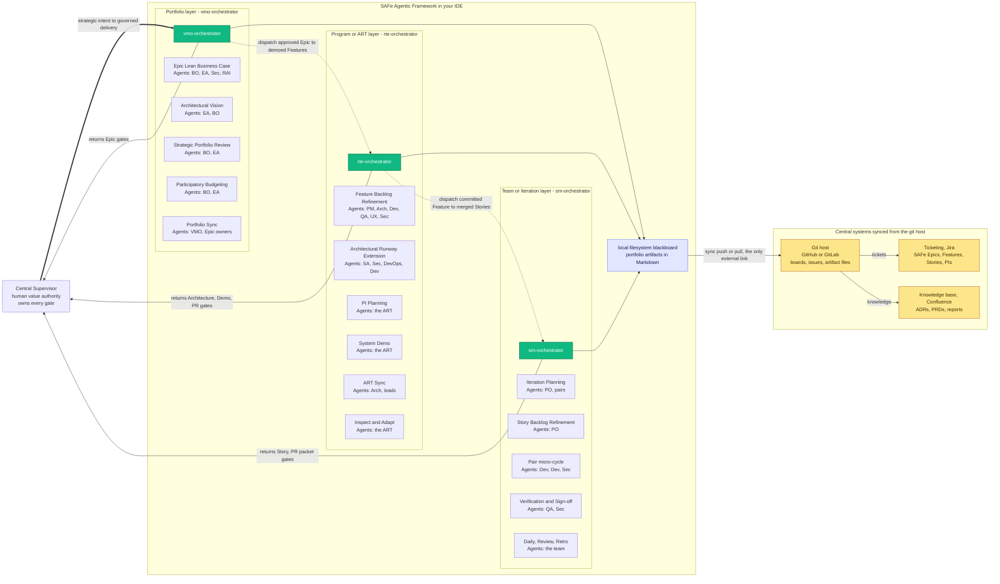

# SAF — the Systemic Agentic Framework

{: .no_toc }

The **Systemic Agentic Framework (SAF)** is a governed, local-first way to run **SAFe** with AI agents. Multi-agent orchestrations — portfolio, program, and iteration — run on your own machine inside your agent host (VS Code / GitHub Copilot today; the harness is host-agnostic), producing standard, schema-validated SAFe artifacts — Epics, Features, Stories, ADRs, kanbans, gate records — synchronized through your organization's own git host. A human ★ gate closes every layer: agents propose through evidence and sequence; the decision stays with you.

SAF complements **[ITIP]()** and integrates with **[SIE]()**: its artifact templates can be sourced as GSM Archetypes, and its agents can consume the organization's governed definitions as context while they work.

## The framework's architecture

Four properties make it work:

1. **Local-first** — the agent loop runs on each user's machine, in the IDE, against the real working tree. Sensitive information never leaves the machine; only the artifacts you commit sync out transparently to your organization's git host.
2. **Governed** — a portfolio → program → iteration hierarchy of role agents, with a human ★ gate at every layer. An org chart with human authority, not a flat swarm.
3. **Sovereign** — work state lives in your own files and git history (the event log), not a vendor's cloud. Nothing is trapped in an unmanaged session.
4. **Portable** — the harness is methodology- and host-agnostic: plain files, a stable CLI, host-specifics isolated behind a thin adapter. The same familiar agentic work method follows you from host to host — VS Code today, another IDE, CI runner, or agent host tomorrow — with no relearning.

Three orchestrators, one per SAFe layer, drive the model — dispatched from a single entry point, `@vmo-orchestrator`:

*Each orchestrator is an entry point carrying your use case for its layer, and **returns that layer's ★ gates to you**. The framework's only external link is the git host — Jira and Confluence sync from there. The full model is on the **[SAFe Agentic Organization]()** page.*

---

## Products

- **[Agentic Harness]()** — the deterministic execution core: it resolves workflows, steps, models, and session context, checks conditions, authorization, and artifacts, and journals every step.
  - [Features]() — the capability catalogue with milestones
- **[SAFe Agentic Organization]()** — the SAFe-shaped framework application the harness executes: orchestrators, the specialist agent bench, skills, workflows, instructions, and artifact schemas.
  - [Features]() — the capability catalogue with milestones
- **[Agentic Workspace]()** — the shared data plane storing the artifacts local agentic workflows produce. *Documentation in construction.*
  - [Features]() — the capability catalogue with milestones
- **[SAF SIE Bridge]()** — the client sourcer turning the harness-governed agentic-execution history into GSM contributions on the Definition Blackboard Manager. *Documentation in construction.*
  - [Features]() — the capability catalogue with milestones

**Next: [Quickstart — your first orchestrated PR →]()**
{: .fs-5 .fw-300 }
