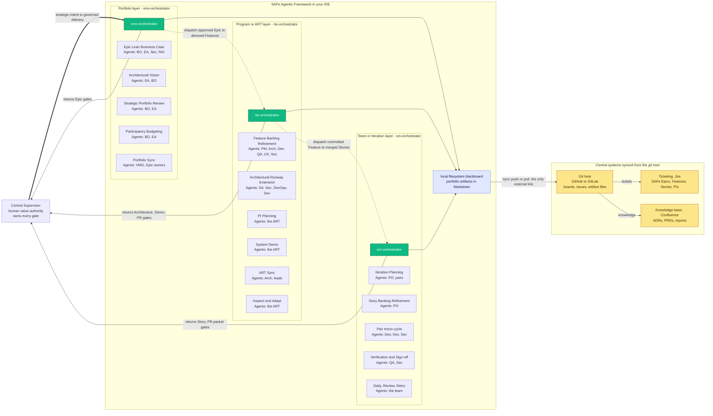

# SAFe Agentic Organization
{: .no_toc }

The **SAFe Agentic Organization** is the SAFe-shaped framework application the [Agentic Harness]() executes. It is not one agent that "does Scrum." It is a *distributed*
system: SAFe governance is split across specialized agents at three layers, the work
state is externalized to a **filesystem blackboard**, and that blackboard is mirrored to
your team's **central systems** (Git host, ticketing, knowledge base). We call this model
**Distributed Agentic SAFe** — to contrast it with *centralized* agentic, where a single
monolithic agent tries to hold the whole lifecycle in one context window.

## Table of contents
{: .no_toc .text-delta }

1. TOC
{:toc}

---

## Centralized vs. distributed

| Axis | Centralized agentic | **Distributed Agentic SAFe** |
|---|---|---|
| Orchestration | one monolithic agent owns the whole lifecycle | decomposed across **3 layer-orchestrators** + a specialist bench |
| Context | a single shared session memory | **no shared memory** — the filesystem blackboard is the bus |
| State | implicit, in-session, lost on reset | **externalized** as committed Markdown; git history *is* the event log |
| Surface | one chat / one app | **IDE ⇆ repository central system** (boards + issues) |
| Models | one model does everything | **deterministic per-task routing** (tier + capability score) |
| Human control | ad-hoc, easy to bypass | a **★ gate at every layer**; the human is the value authority |
| Scaling | vertical (bigger prompt, bigger context) | **horizontal** (divide & conquer, one unit at a time) |

The framework runs *inside your IDE*; the repository system lives *outside* it. The model is
the whole picture — both surfaces, both filesystems, and the synchronization between them.

---

## The model at a glance

How to read it, from the outside in:

- The **Central Supervisor** (you) sits *outside* the framework. You are the value authority
  and the owner of **every ★ gate** — each orchestrator **returns its layer's gates to you**
  for the decision and never crosses one on its own.
- The **SAFe Agentic Framework** box runs in your IDE. The three SAFe layers stack
  vertically; each layer's **orchestrator is its entry point** (carrying your use case for
  that layer), and inside each layer the **ceremonies and practices** sit side by side, each
  naming the **Agents** it convenes from the bench.
- The framework writes everything to a **local filesystem blackboard** — the governed Markdown
  artifacts (Epics, Features, Stories, ADRs, kanban).
- **The framework's only external link is the Git host.** It syncs the blackboard to GitHub /
  GitLab and nothing else; the **ticketing** system (Jira) and the **knowledge base**
  (Confluence) are then synced *from the git host* — so SAFe tickets and a current wiki fall
  out of one integration, not three.

### Legend — agent tokens

| Token | Bench agent (hat) | Token | Bench agent |
|---|---|---|---|
| **BO** | `SE: Product Manager` — Business-Owner hat | **Dev** | `ai-team-dev` |
| **PM** | `SE: Product Manager` — Product-Manager hat | **QA** | `ai-team-qa` |
| **PO** | `SE: Product Manager` — Product-Owner hat | **Sec** | `SE: Security` |
| **EA** | `SE: Architect` — Enterprise-Architect hat | **DevOps** | `SE: DevOps/CI` |
| **SA** | `SE: Architect` — System-Architect hat | **UX** | `SE: UX Designer` |
| **Arch** | `SE: Architect` | **RAI** | `SE: Responsible AI` |

> One agent, many hats: `SE: Product Manager` authors **all** backlog tiers (Epic, Feature,
> Story) — the *hat* changes per layer, not the agent. Orchestrators **never** author backlog
> artifacts and **never** write production code; they *police the flow* (gates, kanban, WIP).

---

## Entry points — the three orchestrators

You can talk to any orchestrator directly, but `@vmo-orchestrator` is the **single entry
point**: it receives your intent as an Epic and dispatches downward. Each orchestrator is the
*police* of its layer — it controls the agents' inputs/outputs, enforces template + SAFe
conformance, and owns the gates and the kanban.

| Orchestrator | SAFe layer | You talk to it to… | Gates it owns / stages | Dispatches |
|---|---|---|---|---|
| `@vmo-orchestrator` | Portfolio (VMO) | turn **strategic intent → approved, funded Epics** | ★ Epic Gate, ★ Epic Outcome Gate | `@rte-orchestrator` per ART |
| `@rte-orchestrator` | Program / ART | turn an **approved Epic → committed, demoed Features** | ★ Feature, ★ Architecture, ★ Demo, ★ PR | `@sm-orchestrator` per iteration |
| `@sm-orchestrator` | Team / Iteration | turn a **committed Feature → merged, QA-signed Stories** | ★ Story (DoR), ★ PR-packet prep | the Driver/Navigator pair |

The backlog spine is **Strategic Theme → Epic → Feature → Story**. There is no PRD tier — the
defining intent a PRD used to carry lives in the **Epic** (its hypothesis + outcome
indicators) and cascades down.

---

## Inside each layer — ceremonies & the agents they convene

Every ceremony and practice is a **facilitated sub-orchestration**: the orchestrator opens it,
sequences the named agents, validates each output, and then commits the unit's new status. No
task is ever solo work.

### Portfolio layer — `@vmo-orchestrator`

| Ceremony / practice | Kind | Agents convened | Produces |
|---|---|---|---|
| Epic Lean Business Case | Practice · CE | **BO** authors · **EA · Sec · RAI** challenge | Epic hypothesis + WSJF |
| Architectural Vision | Practice · CE | **EA** authors · **BO** | NFR backbone + runway + Feature seeds |
| Strategic Portfolio Review | Ceremony | **BO · EA** | WSJF re-rank · themes · pivot/persevere/stop |
| Participatory Budgeting | Ceremony | **BO · EA** (CS commits) | Lean Budgets |
| Portfolio Sync | Ceremony | roll-up of child Features | portfolio risk + Portfolio Kanban |

### Program / ART layer — `@rte-orchestrator`

| Ceremony / practice | Kind | Agents convened | Produces |
|---|---|---|---|
| Feature Backlog Refinement | Ceremony · CE | **PM** authors · **Arch · Dev · QA · UX · Sec** | AC + WSJF + `structurant` flag |
| Architectural Runway Extension | Practice · CE | **SA** authors · **Sec · DevOps · Dev** | an ADR |
| PI Planning | Ceremony | the ART | PI objectives + risks |
| System Demo | Ceremony | the ART (stages ★ Demo Gate) | demoed increment |
| ART Sync | Ceremony | **Arch** + leads | dependencies + risk + runway check |
| Inspect & Adapt | Ceremony | the ART | improvement actions |

### Team / Iteration layer — `@sm-orchestrator`

| Ceremony / practice | Kind | Agents convened | Produces |
|---|---|---|---|
| Iteration Planning | Ceremony | **sm · PO** | sprint plan + Stories + pairs |
| Story Backlog Refinement | Ceremony · CE | **PO** | DoR-ready Stories |
| Pair micro-cycle | Practice · CI | **Dev** (Driver) · **Dev / SE:\*** (Navigator) · **Sec** | code + tests |
| Verification & Sign-off | Practice · CI | **QA · Sec** | QA sign-off |
| Daily Sync · Iteration Review · Retro | Ceremony | the team (+ **CS** at Review) | daily / progress / retro |

> **CE / CI** mark the SAFe Continuous Delivery Pipeline phase — *Continuous Exploration*
> (define + architect + refine) and *Continuous Integration* (build + verify).

---

## Two filesystems, one sync

The model is **distributed across two persistence surfaces**, reconciled by the sync engine
(`portfolio/_sync/`):

- **Framework side — the local filesystem blackboard.** Subagents do *not* share memory; the
  filesystem *is* the shared bus. Every agent reads committed artifacts as input and commits
  its artifact as output. State lives only in `status:` frontmatter, so the git history of
  those flips is an **event log** — *recovering state* is just *reading the current files*.
- **Repository side — the central system's filesystem.** GitHub Projects (or GitLab boards) +
  planning repos hold the mirrored **Epic / Feature / Story** issues — the human-facing
  surface for moving work and for items born on the board.

The sync moves **templated artifacts** between them with clear authority and hard gate safety:

| Concern | Authority | Direction |
|---|---|---|
| Content (title, body, WSJF, risk, parent, estimates) | **local** wins | `push` overwrites the board projection from Markdown |
| Status (non-gate board columns) | **remote** wins | `pull` writes the board column back to frontmatter |
| `blocked` flag | **local** wins | `push` sets/clears the label |
| **Gate-crossing moves** (Architecture / Demo / PR / Epic, and `→ done`) | **neither** | **never auto-applied** — recorded as a *request* for the Central Supervisor to decide in chat |

**Pluggable backends — and SAFe for free.** The "central system" is not one product. The same
templated-artifact sync targets whatever coordination tools your organization runs: a **Git host**
(GitHub / GitLab — code, issues, Projects boards), a **ticketing system** (**Jira** — SAFe Epics,
Features, Stories, sprints, PI boards), and a **knowledge base** (**Confluence** — ADRs, PRDs, and
reports, published from the artifact files stored in git). Because the artifacts are already
template-shaped and governed, the sync emits **textbook-correct SAFe** automatically — the
Epic→Feature→Story hierarchy, WSJF, acceptance criteria, sprint and PI assignment, dependencies, and
end-to-end traceability — instead of anyone hand-typing cards. The administrative tax that makes
SAFe painful is *generated*, not maintained.

Items born on the board with no local match are **materialized locally** from the Feature/Story
template; items born locally are **created remotely**. Sync is non-destructive — it never
closes or deletes work as a side effect.

---

## Why "distributed"?

The model distributes SAFe execution along five independent axes — the opposite of folding everything
into one agent and one context:

1. **Across agents** — three orchestrators + a ten-role specialist bench, each with a narrow
   mandate, instead of one generalist.
2. **Across layers** — portfolio, program, and iteration concerns are governed separately and
   compose top-down (`@vmo → @rte → @sm`).
3. **Across processes** — subagent calls share *no* context; the filesystem blackboard is the
   only channel, so work is reproducible and inspectable.
4. **Across surfaces** — authored in the IDE, coordinated on the repository central system,
   kept consistent by a deterministic sync.
5. **Across models** — every dispatch resolves a model by *task* risk + complexity + capability,
   never "whatever's default."

The human stays the single value authority across all of it: one ★ gate per layer, none of
them automatable.

---

## Build around it — proposed extensions

The model invites tooling. Four concrete, well-scoped builds:

1. **Provider-agnostic sync engine** *(flagship)* — today the central system is GitHub Projects.
   Abstract a `RepositoryProvider` interface (`provision / push / pull / status`) with **GitHub**,
   **GitLab**, **Jira** (ticketing), and **Confluence** (knowledge) adapters, so the same
   templated-artifact sync drives any backend — emitting textbook SAFe tickets and an always-current
   wiki as a byproduct of the work. This generalizes the lower half of the diagram with zero change
   to the framework side.
2. **Blackboard conformance gate (CI)** — a linter that validates every `portfolio/**` artifact
   against its reference template, frontmatter schema, and the orchestration invariants
   (*no gate skipping*, *owner-only transitions*, *single-writer status*). Run it in CI to make
   drift impossible to merge.
3. **Mission control — live state + replay** — render the current kanban from frontmatter and
   reconstruct the full timeline from the git history of `status:` flips (the event log). A
   read-only dashboard that answers "where is everything, and how did it get here?"
4. **Open blackboard protocol** — formalize the *read-committed-input → commit-output* contract
   as a small spec so third-party agents (other vendors, other models) can join the bench as
   first-class participants.
5. **Organizational context over MCP** — an MCP server that streams governed organizational definitions into every agent, so the framework builds with full, governed knowledge of the organization (see the [SAF overview]()).

**Start with #1.** It is the highest-leverage, cleanest-boundary build: it makes the
"central system" pluggable, proves the model is not GitHub-specific, and leaves the
framework, the ceremonies, and the gates entirely untouched.

---

## See also

- **[Quickstart]()** — install and run your first orchestrated PR.
