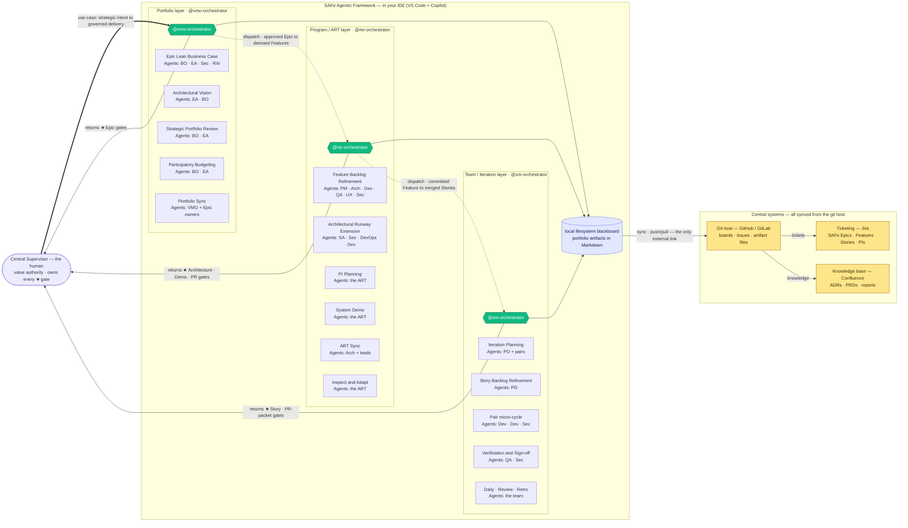

# SAFe Agentic Framework

The **product vision** and the model behind it — **a method, run by agents, that makes agentic delivery trustworthy**, and how the Poesis ecosystem turns it from a coding assistant into an organization-aware engineering capability. To install and run it, see **[Quickstart]()**; for the full model, **[the distributed model]()**.
{: .fs-5 .fw-300 }

## A method makes agentic delivery trustworthy

One idea carries the whole framework.

- **AI runs on intuition — exactly like we do.** An agent is a probabilistic guesser: brilliant, biased, predicting the next move from learned patterns. So is a person. Neither is, at bottom, a logician.
- **Methods are how intuition becomes reliable.** The scientific method, peer review, Scrum, SAFe — each is a *cognitive harness* that pushes a biased mind's output through evidence, checks, and sequence until it comes out trustworthy. *Intuition proposes; the method disposes.*
- **Agents need the same harness — and human methods fit them perfectly,** because those methods were engineered to tame the same probabilistic biases in us. You don't make an agent trustworthy by waiting for a smarter model; you make it **implement a method.**
- **A published standard is the strongest harness of all** — the AI already knows it, complies with it, and reasons in its vocabulary with no retraining. The method becomes a contract between human and machine.

That is what this is: **a method, run by agents, as the harness that makes agentic delivery trustworthy.** The method it runs is **SAFe** — but you don't have to *be* a SAFe organization to get the harness (more on that below). Three properties make it work:

1. **Local-first** — the agent loop runs on each developer's machine, in the IDE, against the real working tree. Your code and secrets never leave; only the artifacts you commit sync out.
2. **Governed** — a portfolio → program → iteration hierarchy of role agents, with a human ★ gate at every layer. Not a flat swarm — an org chart with authority.
3. **Sovereign** — work state lives in your own files and git history (the event log), not a vendor's cloud. Nothing is trapped in a session.

Three orchestrators, one per SAFe layer, run the show — dispatched from a single entry point, `@vmo-orchestrator`:



*Each orchestrator is an entry point carrying your use case for its layer, and **returns that layer's ★ gates to you**. The framework's only external link is the git host — Jira and Confluence sync from there. The full model is on the **[Distributed Agentic SAFe]()** page.*

---

## What it solves that others don't

If you've adopted agentic coding at any scale, you've hit these:

- **Your code on someone else's server.** Cloud agents need your repository inside their sandbox. For IP-sensitive or regulated organizations, that alone is disqualifying. *Local-first execution keeps the code on the machine.*

- **One agent that loses the thread.** A single assistant has no portfolio, no roles, and no memory of why a decision was made three features ago. Scale breaks it. *A role hierarchy carries the context the way an organization does.*

- **No gate, no authority.** Autonomous bots open pull requests nobody scoped; you review after the fact. The human stops being the value authority. *A ★ gate at every layer keeps the human in command.*

- **State trapped in a chat.** Close the session and the plan evaporates — no event log, no recovery, no audit trail. *State lives in committed Markdown; git history is the event log.*

- **No idea what the organization already decided.** Every agent starts from zero. It cannot see your architecture, your standards, or your compliance obligations, so it re-derives — and re-hallucinates — context on every task. *Grounding in governed truth ends the guessing (below).*

- **Lock-in to a vendor runtime.** Your workflow lives inside a proprietary node graph or a hosted control plane you don't own. *Plain files, plain git, a standard IDE.*

These are not tooling gaps. They are symptoms of one root cause: **agentic delivery has been built as a product feature, not as a governed system.** The SAFe Agentic Framework makes it a governed system — local execution, a role hierarchy, per-layer gates, externalized state — and, connected to Poesis, grounded in your organization's own governed definitions.

---

## The agentic coding landscape

The framework occupies a corner that existing categories circle but never claim:

| Category | What it does well | What it misses |
|---|---|---|
| **Cloud SWE agents** (Codex, Devin, Copilot coding agent) | autonomous task→PR, run in parallel | remote execution, no human gate, no org context, code leaves the machine |
| **IDE single-agents** (Aider, Cline, Cursor, Continue) | fast local pairing, git-native | one agent — no roles, ceremonies, or portfolio; no governance |
| **Multi-agent frameworks** (MetaGPT, ChatDev, CrewAI, AutoGen) | role-based collaboration | monolithic in-process, weak human gating, not IDE-native, no repo sync |
| **Workflow orchestrators** (n8n, LangGraph, Temporal) | durable, event-driven automation | centralized execution — system-to-system, not human-supervised construction |
| **SAFe Agentic Framework** | **local-first SAFe orchestration, per-layer human gates, repo sync, org-grounded** | **— the niche the others leave empty** |

The crowded space is the *delegate* corner — cloud single-agent PR bots. The **local-first + governed-hierarchy + organization-grounded** corner was empty. That is where this lives.

---

## SAFe comes with it — if you want it

**You don't need to be a SAFe organization to use this framework.** The harness — trustworthy agentic delivery — is yours either way. But the method the agents run *is* **SAFe**: the one standard that governs delivery end to end, from portfolio strategy down to a single merged commit. So SAFe isn't a prerequisite — it's an option that ships in the box.

**You become a SAFe organization the moment you adopt what the framework hands you.** Accept its delivered artifacts — Epics, Features, Stories, ADRs, PI objectives, kanbans — as your standard formats, and you are *running* SAFe: authored, hierarchized, estimated, and kept in sync by the agents, not by you. No transformation program, no army of consultants — you adopt the outputs, and the practice is simply there. Or don't, and keep just the trustworthy delivery. Your call.

**Why SAFe makes such a good harness for AI:** its much-resented *layers* are exactly the point — **each one is a filter on agent output.** The portfolio layer catches the wrong bet before it is funded; the program layer catches the wrong architecture before it is built; the iteration layer catches the wrong code before it ships. The probabilistic engine isn't checked once — it is harnessed at **every altitude**, each checkpoint owned by a human.

And running all of it **by hand is brutal.** The framework is well-documented; the *bookkeeping* is
relentless — keeping Epics, Features, and Stories correctly shaped, hierarchized, estimated (WSJF),
assigned to sprints and PIs, traceable end to end, and mirrored onto boards and into the wiki. That
overhead is manual, and it decays the moment people get busy. Most "SAFe transformations" stall
exactly there: the practice is sound, but nobody can sustain the administrative tax.

The SAFe Agentic Framework **produces that bookkeeping as a byproduct of doing the work.** Because
every artifact is template-governed and SAFe-shaped from birth, syncing it out **creates textbook
SAFe automatically**:

- **Tickets that follow the practice** — the Epic→Feature→Story hierarchy, WSJF, acceptance
  criteria, sprint and PI assignment, dependencies, and traceability, written into **Jira** (or
  GitHub / GitLab Projects) without anyone hand-typing a card.
- **A knowledge base that stays current** — ADRs, PRDs, and reports, perfectly shaped and published
  to **Confluence** from the artifact files stored in git.
- **Boards that are always live** — portfolio, program, and team kanbans rendered from the same
  governed state, never hand-maintained.

The result is the discipline of SAFe without the overhead that makes it fail: a company gets
**SAFe, correctly implemented, almost for free** — the practice, minus the administrative tax. *(Sync
targets GitHub and GitLab Projects today; Jira and Confluence follow the same pluggable-adapter
design.)*

---

## The Poesis advantage: a framework that knows your organization

This is where the framework stops being "another coding agent" and becomes something no one else can ship. The same way **[ITIP]()** grounds AI in governed truth, the SAFe Agentic Framework is built to **consume that governed truth as it builds**.

### Templates become Archetypes

The framework ships reference templates — Epic, Feature, Story, ADR, the kanban and gate records. On their own, they are disciplined Markdown. **Sourced into GSM, they become [Archetypes]()** — governed definition *types* in **SIE**, each carrying vocabulary (a named type), grammar (it slots into the DNA governance grammar), and semantics (a schema that fixes what every field *means*). Your SAFe artifacts stop being free text and become **typed, versioned, governed definitions** — drift-proof, composable with the frameworks you already govern (TOGAF, ISO, GDPR), and enforceable. An Epic is no longer a document each agent reinterprets; it is a definition the whole organization shares.

### Full organizational context, over MCP

Every agent in the framework can consume **SIE over MCP** (Model Context Protocol) — reading your organization's **governed, causal model** directly: its Structures and Mechanisms, its Directives and Norms, the ITIP-sourced frameworks it must honor. Instead of starting cold and re-deriving context on every task, an orchestrator dispatches agents that already *know* the architecture they are extending and the constraints they must respect. This is ITIP's *grounding-in-governed-truth* principle applied to construction: agents reason over a **write-once, read-many** corpus of definitions — parsed once, consumed forever — so generation is **grounded** (anchored in governed truth, not training priors), **deterministic** (harnessed by GSM types and lifecycle), and **cheaper** (precise structured context instead of token-burning retrieval).

### Agents tuned for GSM and ITIP

The orchestrators and the specialist bench are optimized to **read and generate GSM definitions and ITIP governance data**. A Feature refined against the organization's governed architecture; an ADR that cites the actual Directives it satisfies; a Story whose acceptance criteria trace to enforceable Norms; a pull request that lands **already aligned** to compliance obligations — because the agents that wrote it could see them. Governance stops being a gate you fail at the end and becomes context the agents carry from the start.

### The closed THINK → BUILD loop

ITIP and SIE govern **what should be built** — the THINK layer, the generative definition of the system. The SAFe Agentic Framework **builds it** — the agentic arm of BUILD — reading those definitions as it goes and committing artifacts that feed back as evidence.

```
   ┌──────────── THINK · ITIP / SIE ────────────┐
   │   governed definitions: what to build       │
   └─────────────────────┬───────────────────────┘
                         │  consumed over MCP
                         ▼
   ┌──────── BUILD · SAFe Agentic Framework ─────┐
   │   agents construct it — gated by humans      │
   └─────────────────────┬───────────────────────┘
                         │  commits = evidence
                         ▼
              artifacts feed back as observation
```

Definition generates execution; execution produces observation; observation refines definition. The framework closes the **Definition → Execution** half of the Poesis triad with agents — so the gap between *what the organization decided* and *what actually ships* collapses toward zero.

---

## Open framework, ecosystem superpowers

The framework is **open source (Apache-2.0)** and runs standalone: install it, point it at any GitHub or GitLab repository, and you have a governed, local-first SAFe engine today. **Connected to the Poesis ecosystem, it gains a sense no other delivery tool has — knowledge of your organization.** Templates governed as Archetypes; context streamed from SIE over MCP; agents fluent in GSM and ITIP. The open core gives you the orchestration; the ecosystem gives it *understanding*.

**Next: [Quickstart — your first orchestrated PR →]()**
{: .fs-5 .fw-300 }
