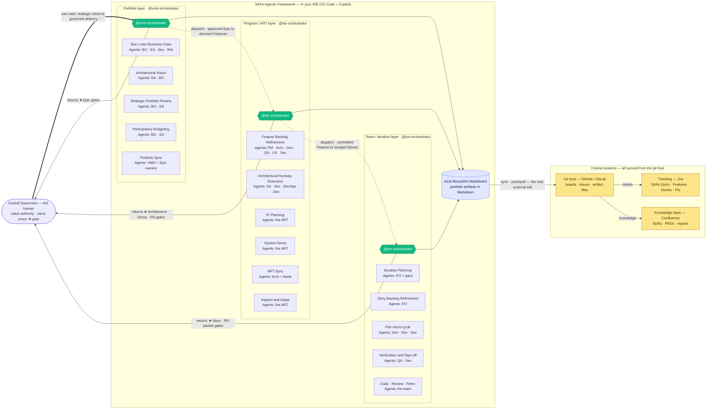

# SAFe, run by agents, as the harness that makes agentic delivery trustworthy
{: .no_toc }

One idea carries the whole framework.

- **AI runs on intuition — exactly like we do.** An agent is a probabilistic guesser: brilliant, biased, predicting the next move from learned patterns. So is a person. Neither is, at bottom, a logician.
- **Methods are how intuition becomes reliable.** The scientific method, peer review, Scrum, SAFe — each is a rational and empirist *cognitive harness* that pushes a biased mind's output through evidence, checks, and sequence until it comes out trustworthy. *Intuition proposes; the method disposes.*
- **Agents need the same harness — and human methods fit them perfectly,** because those methods were engineered to tame the same probabilistic biases in us. You don't make an agent trustworthy by waiting for a smarter model; you make it **implement a method.**
- **A published standard is the strongest harness of all** — the AI already knows it, complies with it, and reasons in its vocabulary with no retraining. The method becomes a contract between human and machine.
- **A multi-layer harness governs every altitude** — divide & conquer only becomes *trustworthy* when every level of the work is bounded and checked. Most methods harness a single layer: Scrum governs the team, ITIL operations, TOGAF architecture. **SAFe governs all of them, from portfolio strategy to a merged commit.** The portfolio layer catches the wrong bet before it is funded; the program layer catches the wrong architecture before it is built; the iteration layer catches the wrong code before it ships. The probabilistic engine isn't filtered once — it is filtered at every level, each checkpoint owned by a human. That is the only harness that matches the full depth of the work.

That is what this is: **a method, run by agents, as the harness that makes agentic delivery trustworthy.** The method it runs is **SAFe** — but you don't have to *be* a SAFe organization to get the harness. Three properties make it work:

1. **Local-first** — the agent loop runs on each developer's machine, in the IDE, against the real working tree. Your code and secrets never leave; only the artifacts you commit sync out.
2. **Governed** — a portfolio → program → iteration hierarchy of role agents, with a human ★ gate at every layer. Not a flat swarm — an org chart with authority.
3. **Sovereign** — work state lives in your own files and git history (the event log), not a vendor's cloud. Nothing is trapped in a session.

Three orchestrators, one per SAFe layer, run the show — dispatched from a single entry point, `@vmo-orchestrator`:

*Each orchestrator is an entry point carrying your use case for its layer, and **returns that layer's ★ gates to you**. The framework's only external link is the git host — Jira and Confluence sync from there. The full model is on the **[Distributed Agentic SAFe]()** page.*
