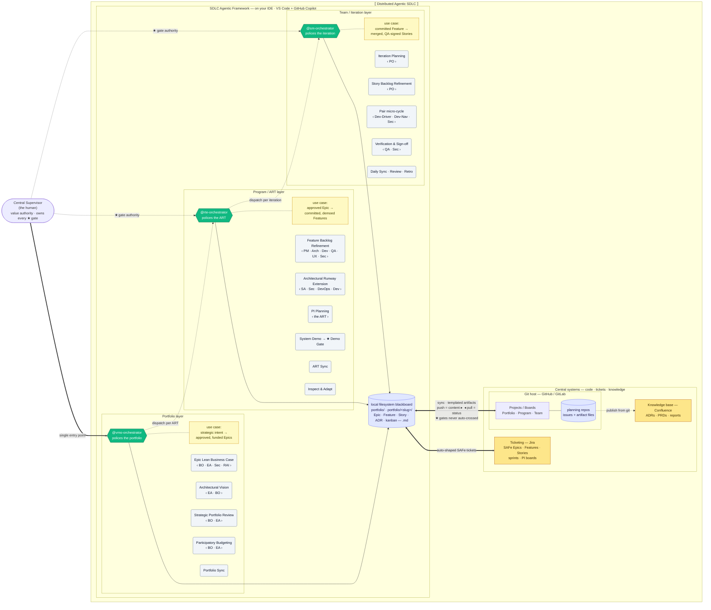

# SDLC Agentic Framework — the Distributed Agentic SDLC

The **product vision** and the model behind it — why software construction needs a *governed, local-first, multi-agent* SDLC, and how the Poesis ecosystem turns it from a coding assistant into an organization-aware engineering capability. To install and run it, see **[Quickstart]()**; for the full model, **[Distributed Agentic SDLC]()**.
{: .fs-5 .fw-300 }

## The missing piece: orchestration that lives where you build

Agentic coding has exploded — but it has split into two shapes, and **both give something up**:

| Shape | What it is | What it gives up |
|---|---|---|
| **Assist** | in-IDE single agent (Aider, Cline, Copilot) | one agent, one context — loses the thread at portfolio scale, no governance |
| **Delegate** | cloud SWE bot (Codex, Devin, Copilot coding agent) | your code on someone's server, async, no human gate, no organizational context |
| **Orchestrate** | *...a governed multi-agent SDLC on your own machine* | *...nothing coherent — until now* |

Single agents are powerful but flat: no roles, no gates, no portfolio. Cloud bots are autonomous but exiled — they run in someone else's sandbox, divorced from your working tree, your toolchain, and your organization's governed truth.

**The SDLC Agentic Framework is the first *distributed* agentic SDLC.** That is a deliberately strong claim, so let's be precise about what "distributed" means:

1. **Local-first** — the agent loop runs on each developer's machine, in the IDE, against the real working tree. Your code and secrets never leave; only the artifacts you commit sync out.
2. **Governed** — a SAFe-shaped portfolio→program→iteration hierarchy of role agents, with a human ★ gate at every layer. Not a flat swarm — an org chart with authority.
3. **Sovereign state** — work state is externalized to a filesystem blackboard and mirrored to your Git host. The git history *is* the event log. Nothing is trapped in a session.



*Three orchestrators, one per SAFe layer, dispatched from a single entry point — `@vmo-orchestrator`. No orchestrator writes production code; they police the flow and delegate to the specialist bench. The full model — layers, ceremonies, agents, and the sync — is on the **[Distributed Agentic SDLC]()** page.*

---

## What it solves that others don't

If you've adopted agentic coding at any scale, you've hit these:

- **Your code on someone else's server.** Cloud agents need your repository inside their sandbox. For IP-sensitive or regulated organizations, that alone is disqualifying. *Local-first execution keeps the code on the machine.*

- **One agent that loses the thread.** A single assistant has no portfolio, no roles, and no memory of why a decision was made three features ago. Scale breaks it. *A role hierarchy carries the context the way an organization does.*

- **No gate, no authority.** Autonomous bots open pull requests nobody scoped; you review after the fact. The human stops being the value authority. *A ★ gate at every layer keeps the human in command.*

- **State trapped in a chat.** Close the session and the plan evaporates — no event log, no recovery, no audit trail. *State lives in committed Markdown; git history is the event log.*

- **No idea what the organization already decided.** Every agent starts from zero. It cannot see your architecture, your standards, or your compliance obligations, so it re-derives — and re-hallucinates — context on every task. *Grounding in governed truth ends the guessing (below).*

- **Lock-in to a vendor runtime.** Your workflow lives inside a proprietary node graph or a hosted control plane you don't own. *Plain files, plain git, a standard IDE.*

These are not tooling gaps. They are symptoms of one root cause: **agentic SDLC has been built as a product feature, not as a governed system.** The SDLC Agentic Framework makes it a governed system — local execution, a role hierarchy, per-layer gates, externalized state — and, connected to Poesis, grounded in your organization's own governed definitions.

---

## The agentic SDLC landscape

The framework occupies a corner that existing categories circle but never claim:

| Category | What it does well | What it misses |
|---|---|---|
| **Cloud SWE agents** (Codex, Devin, Copilot coding agent) | autonomous task→PR, run in parallel | remote execution, no human gate, no org context, code leaves the machine |
| **IDE single-agents** (Aider, Cline, Cursor, Continue) | fast local pairing, git-native | one agent — no roles, ceremonies, or portfolio; no governance |
| **Multi-agent frameworks** (MetaGPT, ChatDev, CrewAI, AutoGen) | role-based collaboration | monolithic in-process, weak human gating, not IDE-native, no repo sync |
| **Workflow orchestrators** (n8n, LangGraph, Temporal) | durable, event-driven automation | centralized execution — system-to-system, not human-supervised construction |
| **SDLC Agentic Framework** | **local-first SAFe orchestration, per-layer human gates, repo sync, org-grounded** | **— the niche the others leave empty** |

The crowded space is the *delegate* corner — cloud single-agent PR bots. The **local-first + governed-hierarchy + organization-grounded** corner was empty. That is where this lives.

---

## SAFe best practice, implemented for you — almost for free

Adopting SAFe is brutal in practice. The *framework* is well-documented; the *bookkeeping* is
relentless — keeping Epics, Features, and Stories correctly shaped, hierarchized, estimated (WSJF),
assigned to sprints and PIs, traceable end to end, and mirrored onto boards and into the wiki. That
overhead is manual, and it decays the moment people get busy. Most "SAFe transformations" stall
exactly there: the practice is sound, but nobody can sustain the administrative tax.

The SDLC Agentic Framework **produces that bookkeeping as a byproduct of doing the work.** Because
every artifact is template-governed and SAFe-shaped from birth, syncing it out **creates textbook
SAFe automatically**:

- **Tickets that follow the practice** — the Epic→Feature→Story hierarchy, WSJF, acceptance
  criteria, sprint and PI assignment, dependencies, and traceability, written into **Jira** (or
  GitHub / GitLab Projects) without anyone hand-typing a card.
- **A knowledge base that stays current** — ADRs, PRDs, and reports, perfectly shaped and published
  to **Confluence** from the artifact files stored in git.
- **Boards that are always live** — portfolio, program, and team kanbans rendered from the same
  governed state, never hand-maintained.

The result is the discipline of SAFe without the overhead that makes it fail: a company gets
**SAFe, correctly implemented, almost for free** — the practice, minus the administrative tax. *(Sync
targets GitHub and GitLab Projects today; Jira and Confluence follow the same pluggable-adapter
design.)*

---

## The Poesis advantage: an SDLC that knows your organization

This is where the framework stops being "another coding agent" and becomes something no one else can ship. The same way **[ITIP]()** grounds AI in governed truth, the SDLC Agentic Framework is built to **consume that governed truth as it builds**.

### Templates become Archetypes

The framework ships reference templates — Epic, Feature, Story, ADR, the kanban and gate records. On their own, they are disciplined Markdown. **Sourced into GSM, they become [Archetypes]()** — governed definition *types* in **SIE**, each carrying vocabulary (a named type), grammar (it slots into the DNA governance grammar), and semantics (a schema that fixes what every field *means*). Your SDLC artifacts stop being free text and become **typed, versioned, governed definitions** — drift-proof, composable with the frameworks you already govern (TOGAF, ISO, GDPR), and enforceable. An Epic is no longer a document each agent reinterprets; it is a definition the whole organization shares.

### Full organizational context, over MCP

Every agent in the framework can consume **SIE over MCP** (Model Context Protocol) — reading your organization's **governed, causal model** directly: its Structures and Mechanisms, its Directives and Norms, the ITIP-sourced frameworks it must honor. Instead of starting cold and re-deriving context on every task, an orchestrator dispatches agents that already *know* the architecture they are extending and the constraints they must respect. This is ITIP's *grounding-in-governed-truth* principle applied to construction: agents reason over a **write-once, read-many** corpus of definitions — parsed once, consumed forever — so generation is **grounded** (anchored in governed truth, not training priors), **deterministic** (harnessed by GSM types and lifecycle), and **cheaper** (precise structured context instead of token-burning retrieval).

### Agents tuned for GSM and ITIP

The orchestrators and the specialist bench are optimized to **read and generate GSM definitions and ITIP governance data**. A Feature refined against the organization's governed architecture; an ADR that cites the actual Directives it satisfies; a Story whose acceptance criteria trace to enforceable Norms; a pull request that lands **already aligned** to compliance obligations — because the agents that wrote it could see them. Governance stops being a gate you fail at the end and becomes context the agents carry from the start.

### The closed THINK → BUILD loop

ITIP and SIE govern **what should be built** — the THINK layer, the generative definition of the system. The SDLC Agentic Framework **builds it** — the agentic arm of BUILD — reading those definitions as it goes and committing artifacts that feed back as evidence.

```
   ┌──────────── THINK · ITIP / SIE ────────────┐
   │   governed definitions: what to build       │
   └─────────────────────┬───────────────────────┘
                         │  consumed over MCP
                         ▼
   ┌──────── BUILD · SDLC Agentic Framework ─────┐
   │   agents construct it — gated by humans      │
   └─────────────────────┬───────────────────────┘
                         │  commits = evidence
                         ▼
              artifacts feed back as observation
```

Definition generates execution; execution produces observation; observation refines definition. The framework closes the **Definition → Execution** half of the Poesis triad with agents — so the gap between *what the organization decided* and *what actually ships* collapses toward zero.

---

## Open framework, ecosystem superpowers

The framework is **open source (Apache-2.0)** and runs standalone: install it, point it at any GitHub or GitLab repository, and you have a governed, local-first SDLC today. **Connected to the Poesis ecosystem, it gains a sense no other SDLC tool has — knowledge of your organization.** Templates governed as Archetypes; context streamed from SIE over MCP; agents fluent in GSM and ITIP. The open core gives you the orchestration; the ecosystem gives it *understanding*.

**Next: [Quickstart — your first orchestrated PR →]()**
{: .fs-5 .fw-300 }
